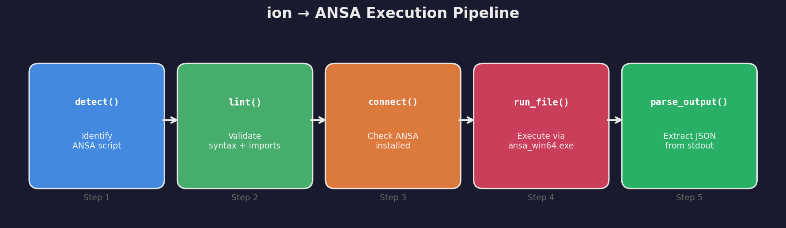
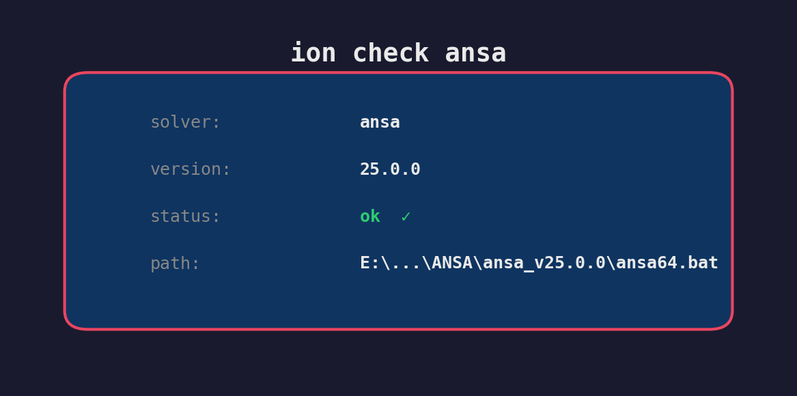
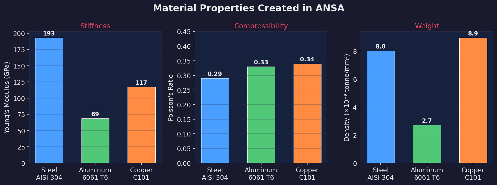
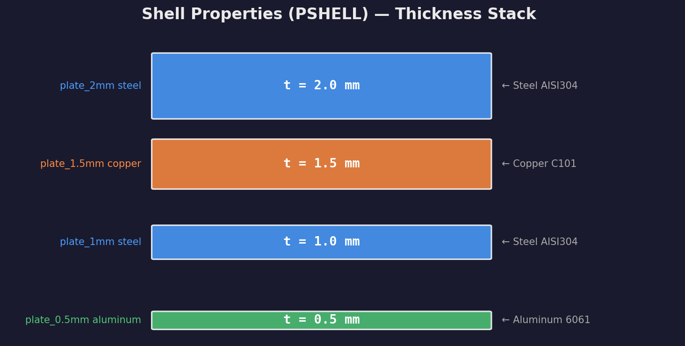
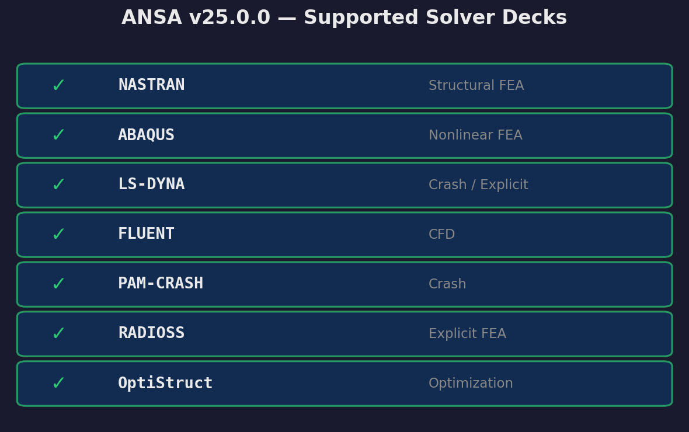
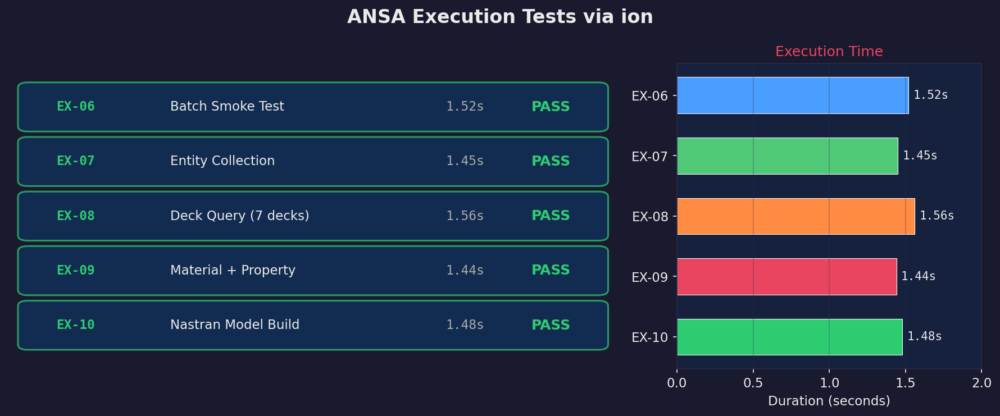

# Nastran Plate Model Setup Demo

Demonstrates ANSA batch automation via ion: creating materials, shell properties,
and querying solver deck capabilities — all in headless mode without GUI interaction.

**Results:** 3 materials (Steel, Aluminum, Copper) and 4 shell properties created
programmatically. All 7 solver decks verified available. Full pipeline completes
in ~1.5 seconds per script.

## Running with ion

```bash
# 1. Check ANSA installation
ion check ansa

# 2. Lint a script before running
ion lint tests/fixtures/ex_hello.py

# 3. Run scripts (one-shot batch execution)
ion run tests/fixtures/ex_hello.py --solver=ansa
ion run tests/fixtures/ex_create_mesh.py --solver=ansa
ion run tests/fixtures/ex_deck_info.py --solver=ansa
ion run tests/fixtures/ex_quality_check.py --solver=ansa
ion run tests/fixtures/ex_nastran_model.py --solver=ansa
```

## Pipeline



The ion driver handles the full lifecycle:
1. **detect()** — Identify ANSA scripts by `import ansa` pattern
2. **lint()** — Validate syntax, check for GUI-only functions
3. **connect()** — Verify ANSA is installed, report version
4. **run_file()** — Launch `ansa_win64.exe -execscript -nogui`, capture output
5. **parse_output()** — Extract JSON from stdout (last JSON line)

## Step 0 — Connect



```python
from ion.drivers.ansa import AnsaDriver
d = AnsaDriver()
c = d.connect()
# → status="ok", version="25.0.0"
```

ANSA v25.0.0 detected at `E:\Program Files (x86)\ANSA\ansa_v25.0.0\`.
The driver sets `ANSA_SRV=localhost` and calls `ansa_win64.exe` directly,
bypassing `ansa64.bat` path-quoting issues.

## Step 1 — Define Materials



```python
# ex_nastran_model.py (excerpt)
steel = base.CreateEntity(deck, "MAT1", {
    "Name": "Steel_AISI304",
    "E": 193000.0,     # Young's modulus (MPa)
    "NU": 0.29,        # Poisson's ratio
    "RHO": 8.0e-9,     # Density (tonne/mm³)
})
```

Three materials created and verified via `get_entity_values()` readback:
- **Steel AISI 304**: E = 193 GPa, ν = 0.29, ρ = 8.0 g/cm³
- **Aluminum 6061-T6**: E = 69 GPa, ν = 0.33, ρ = 2.7 g/cm³
- **Copper C101**: E = 117 GPa, ν = 0.34, ρ = 8.94 g/cm³

## Step 2 — Define Shell Properties



```python
prop = base.CreateEntity(deck, "PSHELL", {
    "Name": "plate_1mm_steel",
    "T": 1.0,          # Thickness (mm)
    "MID1": steel._id, # Material reference
})
```

Four PSHELL properties with varying thickness and material assignments.
Thickness values verified via `get_entity_values(deck, {"T"})` readback.

## Step 3 — Query Solver Deck Support



```python
# ex_deck_info.py
for name in ["NASTRAN", "ABAQUS", "LSDYNA", "FLUENT", ...]:
    if hasattr(constants, name):
        decks_available.append(name)
# → 7 decks available
```

ANSA v25.0.0 supports all 7 major solver decks. Scripts can switch between
decks using `base.SetCurrentDeck(constants.NASTRAN)`.

## Test Results



All 5 execution tests pass through the complete ion pipeline:

| Test | Description | Duration | Result |
|------|-------------|----------|--------|
| EX-06 | Batch smoke test (import + JSON) | 1.52s | PASS |
| EX-07 | Entity collection + property creation | 1.45s | PASS |
| EX-08 | Multi-deck capability query | 1.56s | PASS |
| EX-09 | Material + property create/read cycle | 1.44s | PASS |
| EX-10 | Full Nastran model build | 1.48s | PASS |

## Scripts

| Step | File | Description |
|------|------|-------------|
| 0 | `ex_hello.py` | Minimal smoke test — verify ANSA launches and JSON captured |
| 1 | `ex_nastran_model.py` | Create 3 materials + 4 shell properties |
| 2 | `ex_deck_info.py` | Query all available solver decks |
| 3 | `ex_create_mesh.py` | Entity collection and property creation |
| 4 | `ex_quality_check.py` | Material → property → readback verification |

## Key Differences from COMSOL/Fluent Cookbooks

| Aspect | COMSOL/Fluent | ANSA |
|--------|---------------|------|
| Execution model | Persistent session (`connect/exec/disconnect`) | One-shot batch (`run_file`) |
| Visualization | GUI screenshots | Data-driven plots (matplotlib) |
| Script injection | Snippets into live session | Complete standalone scripts |
| Startup time | Session launch ~10-30s | Per-script ~1.5s |
| API access | External (LiveLink / gRPC) | Process-internal only |

ANSA has no external API or GUI automation path — all automation must go through
`ansa_win64.exe -execscript`. The ion driver wraps this cleanly with proper
environment setup, JSON output parsing, and result storage.
