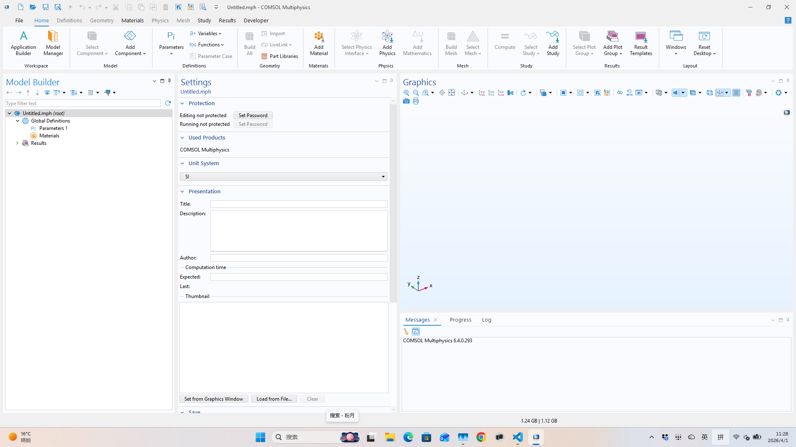
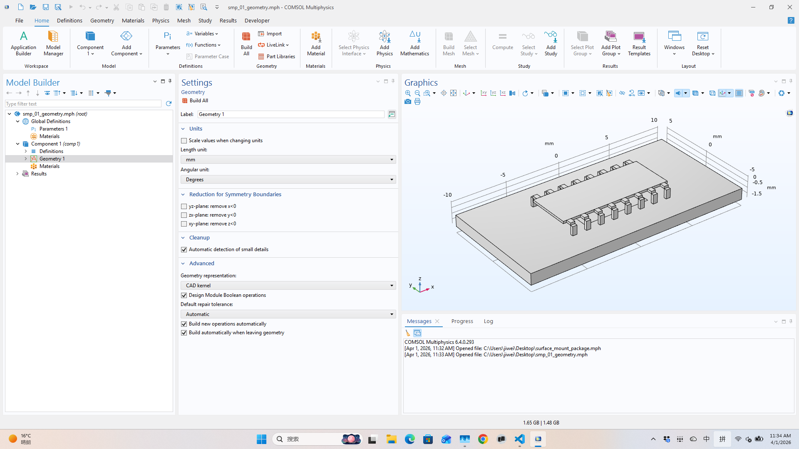
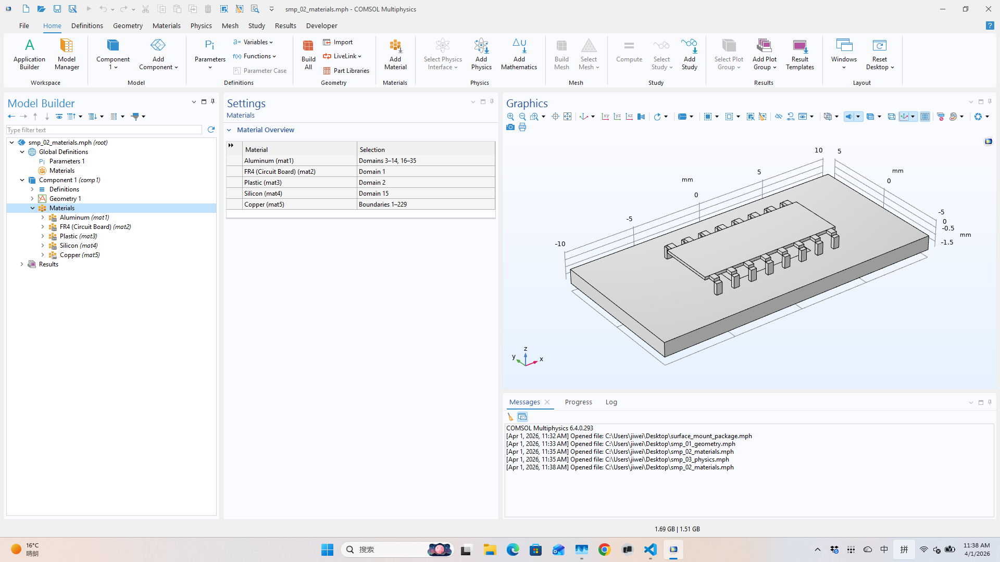
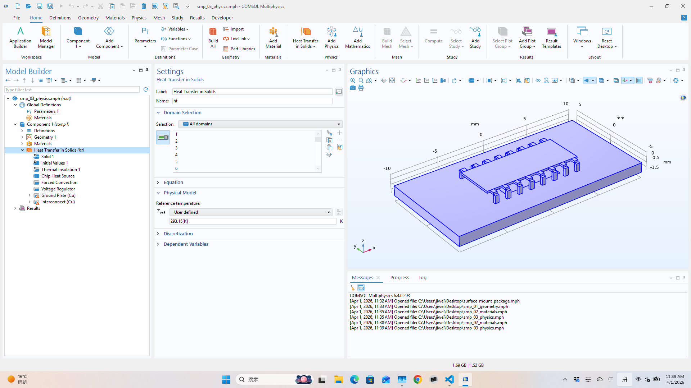
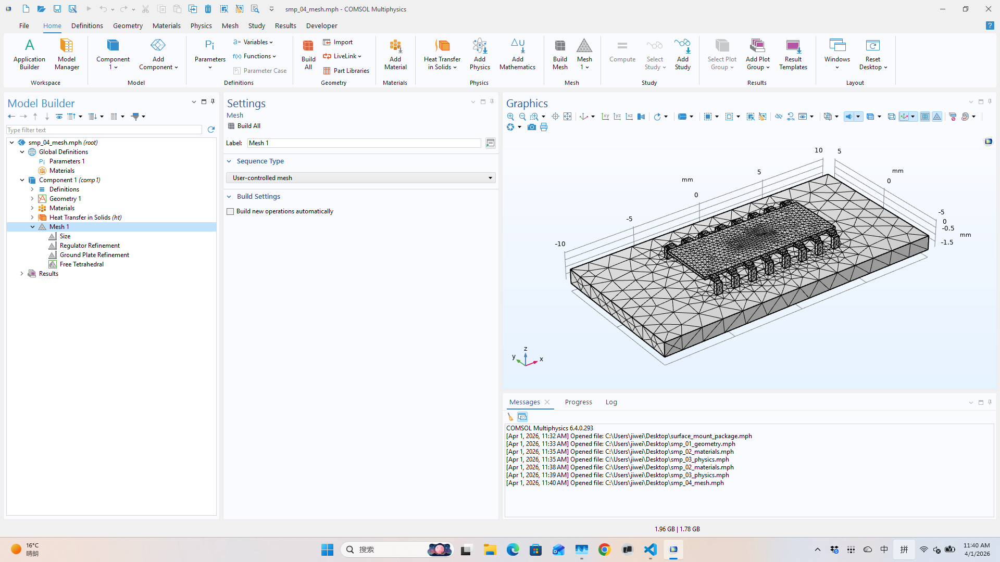
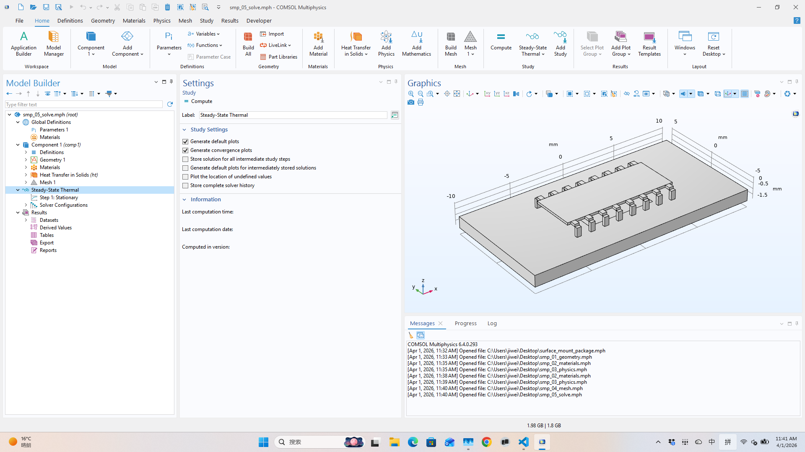
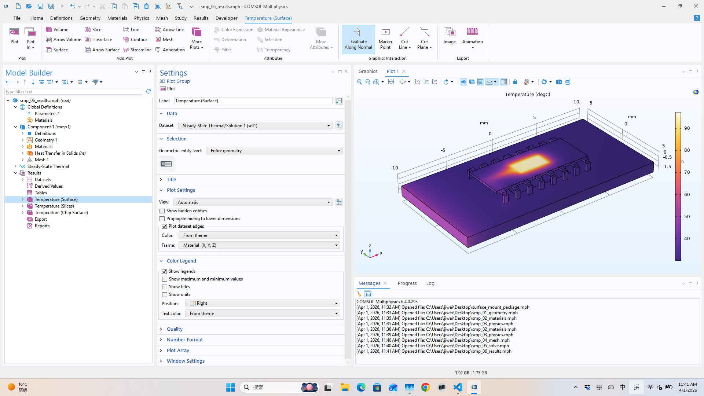
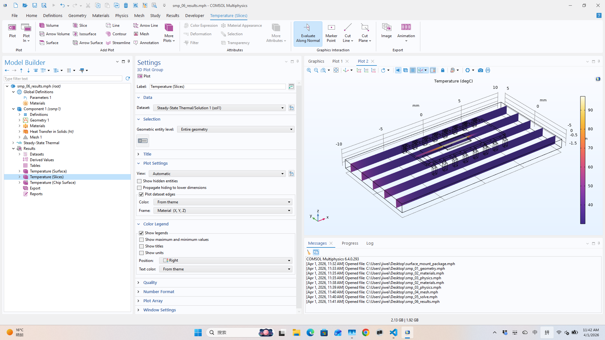

# What Does It Look Like When Claude Drives COMSOL Directly?

*A step-by-step walkthrough of building a complete thermal model — geometry to results — with an AI agent at the controls.*

**Key takeaways:**
- The agent connects to a **live COMSOL session** — no copy-pasting code into Application Builder
- It writes Python that calls COMSOL's Java API via JPype, executed in-process through `ion exec`
- It **sees the GUI** via desktop screenshots, the same way a human looks at the screen
- When something fails — a selection misses, a mesh has bad elements, the solver doesn't converge — the agent **reads the error, diagnoses, and retries** in the same session
- The difference between "AI generates a script" and "AI drives the simulation" is the **closed feedback loop**: execute, observe, adapt

---

Most attempts at using AI with COMSOL boil down to asking a chatbot to write methods, then copy-pasting them into Application Builder. That works for geometry scripting, but it breaks the feedback loop — the AI never sees the model, never catches errors visually, and can't iterate.

What if the agent could connect to a live COMSOL session, execute code, and see the GUI — the same way you would?

This post walks through exactly that: reproducing [COMSOL Application Library model 847](https://www.comsol.com/model/heat-transfer-in-a-surface-mount-package-for-a-silicon-chip-847) (Heat Transfer in a Surface-Mount Package for a Silicon Chip) from scratch, with Claude at the controls.

## The setup

[ion](https://github.com/svd-ai-lab/ion) is a lightweight runtime that connects AI agents to physics solvers. For COMSOL, it works like this:

```
┌─────────────┐        HTTP        ┌─────────────────────────────┐
│  Claude      │  ───────────────▶  │  ion serve (Windows machine) │
│  (agent)     │  ◀───────────────  │  COMSOL via JPype + Java API │
└─────────────┘   exec / screenshot └─────────────────────────────┘
```

The agent connects to a persistent COMSOL session. It can:
- **`ion exec`** — send Python code that runs inside the live COMSOL model
- **`ion screenshot`** — capture the server's desktop to see the COMSOL GUI
- **`ion inspect`** — query model state (materials, physics nodes, mesh stats)

No file round-tripping. No restarting COMSOL between steps. The model object stays in memory across all commands.

## The model

A silicon chip in a plastic surface-mount package sits on an FR4 circuit board near a hot voltage regulator (50 °C). The chip dissipates ~20 mW. Copper thin layers provide heat spreading. Forced convection cools the exterior.

**Goal:** find the chip's maximum temperature and confirm it doesn't overheat.

---

## Step 0: Connect to COMSOL

Claude starts a persistent session with the COMSOL GUI visible:

```bash
ion connect --solver comsol --ui-mode gui
```

> **`ion screenshot`** after connect:
>
> 

COMSOL Desktop opens with a blank model. The agent now has a live handle to it.

---

## Step 1: Create geometry

Claude sends `00_create_geometry.py` via `ion exec`. The script builds:
- PC board (20 × 10 × 1 mm)
- Chip package body (9.9 × 3.9 × 0.2 mm)
- 16 gull-wing pins (L-shaped blocks, 8 per side)
- Silicon chip (3 × 1.5 × 0.1 mm)
- Work planes for ground plate and interconnect copper layers

The key code pattern — everything goes through COMSOL's Java API via JPype:

```python
geom = model.component("comp1").geom().create("geom1", 3)
geom.lengthUnit("mm")

blk1 = geom.create("blk1", "Block")
blk1.set("size", JD([20.0, 10.0, 1.0]))
blk1.set("pos", JD([-10.0, -5.0, -1.9]))
blk1.label("PC Board")
# ... 16 pins, chip, work planes ...
geom.run("fin")
```

> **`ion screenshot`** after geometry:
>
> 

The agent can now visually confirm the geometry looks right — all 16 pins present, chip centered on the package, board dimensions correct.

---

## Step 2: Assign materials

Five materials, applied using Ball selections to identify each domain by position:

| Material | Domain | k (W/m·K) |
|----------|--------|-----------|
| Aluminum | All (pins are majority) | 237 |
| FR4 | Circuit board | 0.3 |
| Plastic | Package body | 0.2 |
| Silicon | Chip | 130 |
| Copper | Thin layer boundaries | 400 |

```python
sel_chip = comp.selection().create("sel_chip", "Ball")
sel_chip.set("posx", "0"); sel_chip.set("posy", "0")
sel_chip.set("posz", "-0.05"); sel_chip.set("r", "0.01")

mat4 = comp.material().create("mat4", "Common")
mat4.label("Silicon")
mat4.selection().named("sel_chip")
mat4.propertyGroup("def").set("thermalconductivity", JS(["130[W/(m*K)]"]))
```

> **`ion screenshot`** after materials:
>
> 

---

## Step 3: Set up physics

Heat Transfer in Solids with five features:

1. **Heat source** — 2×10⁸ W/m³ on the silicon chip (~20 mW total)
2. **Forced convection** — h = 50 W/(m²·K), T_amb = 30 °C on all exterior surfaces
3. **Fixed temperature** — 50 °C on the voltage regulator boundary
4. **Thin layer 1** — ground plate (copper, 0.1 mm)
5. **Thin layer 2** — interconnect trace (copper, 5 µm)

```python
ht = comp.physics().create("ht", "HeatTransfer", "geom1")
hs1 = ht.create("hs1", "HeatSource", 3)
hs1.selection().named("sel_chip")
hs1.set("Q0", "2e8[W/m^3]")
```

The script includes a verification loop that prints how many entities each physics feature selected — the agent reads this output to confirm nothing was missed.

> **`ion screenshot`** after physics:
>
> 

---

## Step 4: Generate mesh

Fine global mesh with extra-fine refinement on the voltage regulator and ground plate boundaries:

```python
mesh = model.component("comp1").mesh().create("mesh1")
mesh.autoMeshSize(jpype.JDouble(4))  # Fine
# ... local refinements ...
mesh.run()
```

The script reports element count and minimum quality. Claude reads these to verify mesh quality before solving.

> **`ion screenshot`** after meshing:
>
> 

---

## Step 5: Solve

A stationary (steady-state) study — the solver typically finishes in under 10 seconds:

```python
std = model.study().create("std1")
std.create("stat", "Stationary")
model.sol().create("sol1")
model.sol("sol1").createAutoSequence("std1")
model.sol("sol1").runAll()
```

> **`ion screenshot`** after solve:
>
> 

---

## Step 6: Plot results

Three visualizations:

1. **Surface temperature** — full assembly overview
2. **Temperature slices** — ZX cross-sections through the package
3. **Chip surface detail** — zoomed in on the silicon die

```python
pg1 = res.create("pg1", "PlotGroup3D")
pg1.label("Temperature (Surface)")
s1 = pg1.create("surf1", "Surface")
s1.set("expr", "T"); s1.set("unit", "degC")
s1.set("colortable", "HeatCameraLight")
pg1.run()
```

> **`ion screenshot`** — surface temperature:
>
> 

> **`ion screenshot`** — temperature slices:
>
> 

> **`ion screenshot`** — chip surface:
>
> 

**Result: chip max temperature ≈ 45.8 °C** — the device does not overheat. (Reference value: 47.7 °C; the ~2 °C difference comes from simplified pin geometry.)

---

## The agent loop

Every step above follows the same pattern:

1. Claude decides what to do next (e.g., "create geometry")
2. Claude writes a Python snippet using COMSOL's Java API (via JPype)
3. `ion exec` sends the snippet to the running COMSOL process
4. COMSOL executes it in-process — the model updates live
5. `ion screenshot` captures the desktop so Claude can see the GUI
6. Claude checks the screenshot, decides the next step
7. If something looks wrong, Claude writes a fix and re-executes

No batch scripts. No copy-pasting into Application Builder. No restarting COMSOL between steps. The model object **persists in memory** across all `exec` calls — Step 2 references geometry from Step 1, Step 3 uses named selections from Step 2.

## When things go wrong (and why that's the point)

The clean walkthrough above might suggest this is a one-shot process — write the script, run it, done. In practice, things fail. A Ball selection misses its target domain. A material property has the wrong units. A mesh operation fails because the geometry has a sliver face. The solver doesn't converge.

**This is where the harness matters.** When a step fails, the agent doesn't crash out — it reads the error, takes a screenshot to see the model state, diagnoses the problem, and sends a corrected snippet. The session is still alive. The model is still in memory. The agent just tries again.

For example, during development of this walkthrough:
- A pin union failed because two blocks didn't share a face — the agent adjusted the overlap and re-ran the geometry step
- A Ball selection for the chip domain returned 0 entities — the agent checked the z-coordinate, realized the chip center was at -0.05 not 0.0, and fixed the selection radius
- The mesh initially had poor quality elements near thin pins — the agent added local refinement and re-meshed

None of these required human intervention. The agent saw the failure, understood the cause, and fixed it — in the same live session.

**This is the real difference between "AI generates a script" and "AI drives the simulation."** Script generation is one-shot: it either works or you're back to debugging by hand. A harness gives the agent a closed feedback loop — execute, observe, adapt — the same loop a human engineer uses, just without the manual overhead.

## What this enables

An agent with domain knowledge can drive the entire modeling workflow — geometry, materials, physics, meshing, solving, post-processing — writing API calls on the fly, adapting to whatever the problem requires. No pre-recorded methods or Application Builder macros needed.

The key insight: **COMSOL's Java API is the automation interface, and JPype makes it callable from Python.** Once you have that bridge and a runtime to manage the session, the agent has the same access to COMSOL that a human has through the GUI — including the ability to see what went wrong and try again.

---

*Built with [ion](https://github.com/svd-ai-lab/ion) — the physics simulation runtime for AI agents.*
