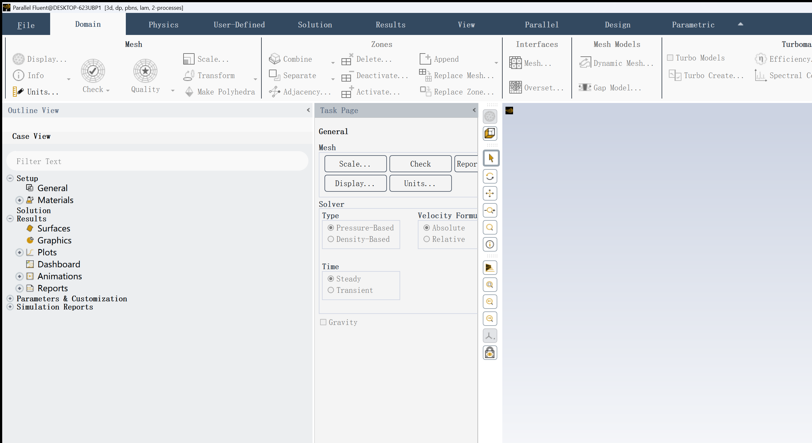
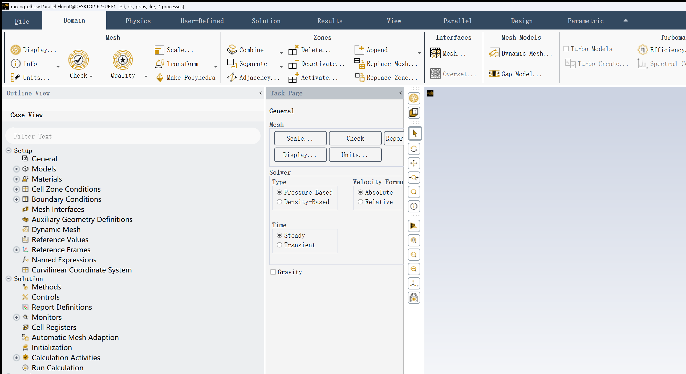
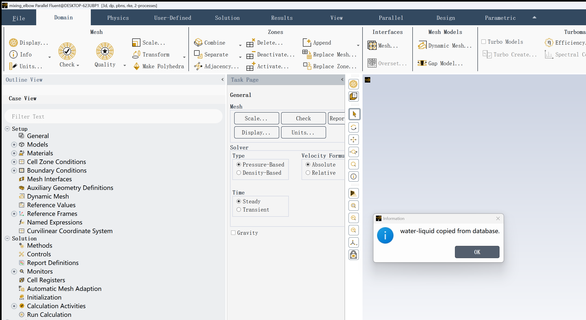
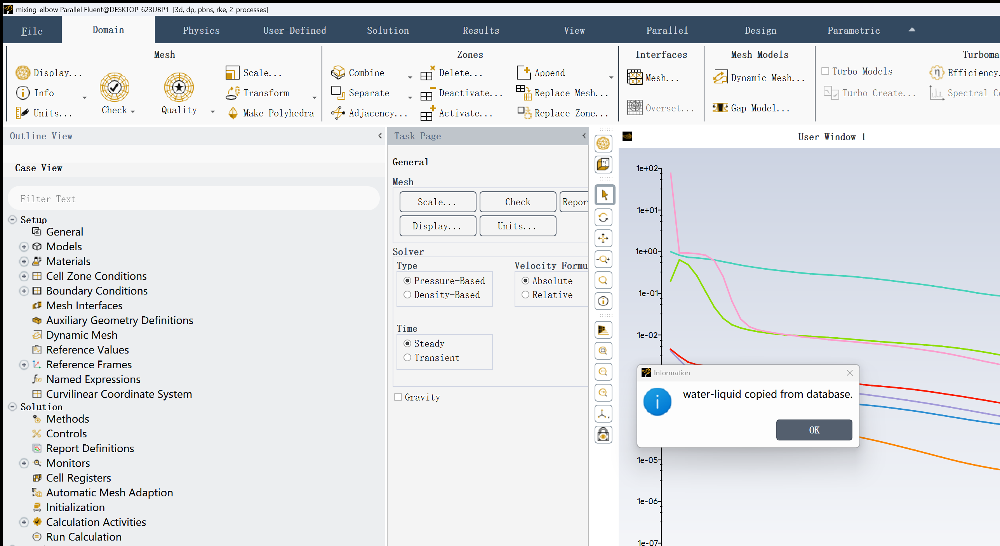

# What Does It Look Like When Claude Drives Ansys Fluent?

*A step-by-step walkthrough of running a complete CFD simulation — mesh to results — with an AI agent at the controls.*

**Key takeaways:**
- The agent connects to a **live Fluent session** — no pre-recorded journals, no copy-pasting scripts into the console
- It writes PyFluent code that executes inside the running solver via `sim exec`
- Fluent's GUI stays open the entire time — the engineer can watch every boundary condition, every residual plot update in real time
- Each step is verified by querying `sim inspect last.result` — the agent **reads the structured output before deciding what to do next**
- When something goes wrong — a zone name doesn't exist, a mesh has issues, the solver diverges — the agent **reads the error, diagnoses, and adapts** in the same live session
- The difference between "AI generates a Fluent journal" and "AI drives Fluent" is the **closed feedback loop**: connect, execute, inspect, decide

---

Most attempts at using AI with Fluent follow the same pattern: ask a chatbot to generate a TUI journal or a PyFluent script, copy it somewhere, run it, and hope for the best. When it fails on line 47 — wrong zone name, mismatched API path, missing physics model — you're back to debugging by hand.

What if the agent could connect to a live Fluent session, execute code step by step, and inspect the result at each stage — the same way you would?

This post walks through exactly that: solving the classic [Ansys Fluent mixing elbow tutorial](https://ansyshelp.ansys.com/public/account/secured?returnurl=/Views/Secured/corp/v241/en/flu_tut/flu_tut_mixing_elbow.html) from mesh to extracted temperature, with Claude at the controls.

## The setup

[sim](https://github.com/svd-ai-lab/sim-cli) is a lightweight runtime that connects AI agents to physics solvers. For Fluent, it works like this:

```
┌─────────────┐        HTTP        ┌──────────────────────────────┐
│  Claude      │  ───────────────▶  │  sim serve (Windows machine)  │
│  (agent)     │  ◀───────────────  │  Fluent via PyFluent 0.37     │
└─────────────┘   exec / inspect   │       │                       │
                                   │  ┌────▼──────────────────┐    │
                                   │  │  Fluent GUI (visible)  │    │
                                   │  └───────────────────────┘    │
                                   └──────────────────────────────┘
```

The agent connects to a **persistent Fluent session**. It can:
- **`sim exec`** — send a Python snippet that runs inside the live solver, with `solver` object already injected
- **`sim inspect`** — query session state: which step just ran, did it succeed, what was the result
- **`sim disconnect`** — cleanly shut down the Fluent process

No fire-and-forget scripts. No restarting Fluent between steps. The solver object **stays in memory** across all commands — step 5 can reference the mesh loaded in step 1.

## The model

A mixing elbow: cold water (20 °C, 0.4 m/s) enters from a large pipe, hot water (40 °C, 1.2 m/s) enters from a smaller side pipe, and they mix as they flow through an elbow to the outlet.

**Goal:** run a steady-state RANS simulation (realizable k-epsilon, energy equation) for 150 iterations and extract the outlet area-weighted average temperature.

---

## Step 0: Connect to Fluent

Claude starts a persistent solver session with the GUI visible:

```bash
sim connect --solver fluent --mode solver --ui-mode gui --processors 2
```

```json
{
  "session_id": "6e03c0e9-321c-4193-9632-f8aa83f51bd8",
  "solver": "fluent",
  "mode": "solver",
  "ui_mode": "gui",
  "run_count": 0
}
```

> **`sim screenshot`** after connect:
>
> 

Fluent Desktop opens. The agent now has a live handle to the solver.

---

## Step 1: Read the mesh

Claude sends a snippet via `sim exec`. The `solver` object is already injected into the namespace — no `import`, no `launch_fluent()`:

```python
solver.settings.file.read_case(file_name=r"E:\sim\cases\mixing_elbow.msh.h5")
_result = {"step": "read-case", "ok": True}
```

Fluent loads the mesh and reports:

```
Reading from DESKTOP-623UBP1:"E:\sim\cases\mixing_elbow.msh.h5" in NODE0 mode ...
  Reading mesh ...
       17822 cells,     1 cell zone  ...
       91581 faces,     7 face zones ...
Done.
```

The agent confirms via `sim inspect last.result`:

```json
{"label": "read-case", "ok": true, "elapsed_s": 5.6}
```

`ok: true` — proceed to the next step.

> **`sim screenshot`** after reading mesh:
>
> 

---

## Step 2: Check the mesh

```python
solver.settings.mesh.check()
_result = {"step": "mesh-check", "ok": True}
```

```
Domain Extents:
  x-coordinate: min (m) = -2.000e-01, max (m) = 2.000e-01
  y-coordinate: min (m) = -2.250e-01, max (m) = 2.000e-01
Volume statistics:
  minimum volume (m3): 2.444e-10
  maximum volume (m3): 5.720e-07
    total volume (m3): 2.501e-03
Checking mesh.....................................
Done.
```

No negative volumes. Mesh is clean.

> **`sim screenshot`** after mesh check:
>
> 

---

## Step 3: Discover boundary zones

This is a critical step. **The agent never assumes zone names** — it queries the live mesh:

```python
bc = solver.settings.setup.boundary_conditions

velocity_inlets  = list(bc.velocity_inlet.keys())
pressure_outlets = list(bc.pressure_outlet.keys())
walls            = list(bc.wall.keys())
cell_zones       = list(solver.settings.setup.cell_zone_conditions.fluid.keys())

_result = {
    "velocity_inlets": velocity_inlets,
    "pressure_outlets": pressure_outlets,
    "walls": walls,
    "cell_zones": cell_zones,
}
```

```json
{
  "velocity_inlets": ["hot-inlet", "cold-inlet"],
  "pressure_outlets": ["outlet"],
  "walls": ["wall-inlet", "wall-elbow"],
  "cell_zones": ["elbow-fluid"]
}
```

Now the agent knows the exact zone names from the actual mesh. It uses these — not names from a tutorial PDF — in all subsequent steps.

> **`sim screenshot`** after zone discovery:
>
> 

---

## Step 4: Set up physics

Enable the energy equation and realizable k-epsilon turbulence model:

```python
solver.settings.setup.models.energy.enabled = True

viscous = solver.settings.setup.models.viscous
viscous.model = "k-epsilon"
viscous.k_epsilon_model = "realizable"

_result = {"step": "setup-physics", "energy_enabled": True, "ok": True}
```

> **`sim screenshot`** after physics setup:
>
> 

---

## Step 5: Assign material

Copy water-liquid from the database and assign it to the fluid zone:

```python
solver.settings.setup.materials.database.copy_by_name(type="fluid", name="water-liquid")
solver.settings.setup.cell_zone_conditions.fluid["elbow-fluid"].material = "water-liquid"

_result = {"step": "setup-material", "material": "water-liquid", "ok": True}
```

> **`sim screenshot`** after material assignment:
>
> 

---

## Step 6: Set boundary conditions

This is where discovered zone names matter. The agent uses `"cold-inlet"` and `"hot-inlet"` — the names from Step 3:

```python
cold_inlet = solver.settings.setup.boundary_conditions.velocity_inlet["cold-inlet"]
cold_inlet.momentum.velocity.value = 0.4           # m/s
cold_inlet.turbulence.turbulent_specification = "Intensity and Hydraulic Diameter"
cold_inlet.turbulence.turbulent_intensity = 0.05    # 5%
cold_inlet.turbulence.hydraulic_diameter = "4 [in]"
cold_inlet.thermal.t.value = 293.15                 # 20 °C

hot_inlet = solver.settings.setup.boundary_conditions.velocity_inlet["hot-inlet"]
hot_inlet.momentum.velocity.value = 1.2             # m/s
hot_inlet.turbulence.turbulent_specification = "Intensity and Hydraulic Diameter"
hot_inlet.turbulence.turbulent_intensity = 0.05
hot_inlet.turbulence.hydraulic_diameter = "1 [in]"
hot_inlet.thermal.t.value = 313.15                  # 40 °C

_result = {"step": "setup-bcs", "ok": True}
```

> **`sim screenshot`** after boundary conditions:
>
> 

A note on API paths: PyFluent 0.37.x uses `.momentum.velocity.value` (not `.velocity_magnitude.value`) and `.thermal.t.value` (not `.thermal.temperature.value`). These differ from the 0.38 reference docs. The agent learns this from prior runs or reference documentation — another reason the feedback loop matters.

---

## Step 7: Initialize and solve

Hybrid initialization, then 150 iterations:

```python
solver.settings.solution.initialization.hybrid_initialize()
_result = {"step": "hybrid-init", "ok": True}
```

```
Initialize using the hybrid initialization method.
Checking case topology...
-This case has both inlets & outlets

Hybrid initialization is done.
```

```python
solver.settings.solution.run_calculation.iterate(iter_count=150)
_result = {"step": "run-iterations", "iterations_run": 150, "ok": True}
```

The solver converges at iteration 87:

```
  iter  continuity  x-velocity  y-velocity  z-velocity      energy           k     epsilon
     1  1.0000e+00  4.1581e-03  4.5234e-03  1.2064e-03  8.6852e-05  1.9836e-01  7.6522e+01
     2  8.2238e-01  2.5038e-03  3.0827e-03  7.7729e-04  1.0102e-04  6.3942e-01  9.3571e-01
   ...
    86  1.0286e-03  1.1107e-06  2.5389e-06  7.8051e-07  5.7379e-08  1.9873e-05  1.0316e-05
    87  9.0712e-04  9.8736e-07  2.2373e-06  6.8674e-07  5.0544e-08  1.7260e-05  8.9194e-06
!   87 solution is converged
```

> **`sim screenshot`** — residuals converging:
>
> 

The engineer can watch the residuals drop in real time in the Fluent GUI — the agent is driving, but the human has full visibility.

---

## Step 8: Extract results

Create a report definition and compute the outlet area-weighted average temperature:

```python
rep = solver.settings.solution.report_definitions
rep.surface["outlet-temp-avg"] = {}
outlet_rep = rep.surface["outlet-temp-avg"]
outlet_rep.report_type = "surface-areaavg"
outlet_rep.field = "temperature"
outlet_rep.surface_names = ["outlet"]

result = rep.compute(report_defs=["outlet-temp-avg"])
temp_K = result[0]["outlet-temp-avg"][0]    # 295.558 K
temp_C = round(temp_K - 273.15, 4)          # 22.4077 °C

_result = {
    "outlet_avg_temp_K": temp_K,
    "outlet_avg_temp_C": temp_C,
    "ok": True,
}
```

```json
{
  "outlet_avg_temp_K": 295.557660451648,
  "outlet_avg_temp_C": 22.4077,
  "ok": true
}
```

> **`sim screenshot`** — results extracted:
>
> 

**Result: outlet area-weighted average temperature = 22.41 °C.**

The cold stream (20 °C) dominates because the cold inlet has a larger cross-section, even though the hot stream enters at 3x the velocity. Physically reasonable.

---

## Step 9: Disconnect

```bash
sim disconnect
```

```json
{"session_id": "6e03c0e9-...", "disconnected": true}
```

Fluent shuts down cleanly. The full session — 9 steps, from connect to disconnect — took about 90 seconds.

---

## The agent loop

Every step above follows the same pattern:

```
1. Claude decides the next action
2. Claude writes a PyFluent snippet
3. `sim exec` sends it to the running Fluent process
4. Fluent executes it — the GUI updates live
5. `sim inspect last.result` returns structured JSON: ok, stdout, result
6. Claude reads the result, decides what's next
7. If ok=false: read the error, diagnose, fix, re-execute (same session)
```

The model object **persists in memory** across all `exec` calls. Step 6 references the mesh from Step 1, the physics from Step 4, the material from Step 5. No file round-tripping. No restarting.

And crucially: after every step, the agent checks `ok: true` before proceeding. If a step fails, execution **stops immediately**. The agent reads the error, not just the exit code.

## When things go wrong (and why that's the point)

The clean walkthrough above makes this look like a one-shot process. It isn't. Here's what happens when things fail:

**Wrong zone name:**

```python
solver.settings.setup.boundary_conditions.velocity_inlet["wrong-cold-inlet"]
```

```
KeyError: "'velocity_inlet' has no attribute 'wrong-cold-inlet'.
The most similar names are: cold-inlet"
```

The agent gets `ok: false`, reads the `KeyError`, sees Fluent's suggestion ("most similar: cold-inlet"), and either fixes the name or runs the zone diagnostic snippet. The session is still alive. The mesh is still loaded. No restart needed.

**This is why Step 3 exists.** The agent queries zone names from the live mesh instead of guessing from a tutorial. Zone names vary between meshes — what's `"cold-inlet"` in one mesh might be `"velocity-inlet-5"` in another.

**PyFluent API mismatch:**

PyFluent 0.37 and 0.38 have different attribute paths. `.momentum.velocity.value` in 0.37 becomes `.velocity_magnitude.value` in 0.38. A script that works on one version crashes on the other.

The agent discovers this through the feedback loop: try the API call, read the error, adjust. The session survives the error — the solver state is unchanged.

**This is the real difference between "AI generates a Fluent journal" and "AI drives Fluent."** Journal generation is one-shot: it either works or you're debugging line by line. A persistent session with step-by-step inspection gives the agent the same closed feedback loop a human engineer uses — execute, observe, adapt.

## Beyond solver: meshing too

The same pattern works for meshing workflows. Connect in meshing mode, drive the watertight geometry workflow step by step:

```bash
sim connect --solver fluent --mode meshing --ui-mode gui --processors 2
```

```python
# Initialize workflow
meshing.workflow.InitializeWorkflow(WorkflowType="Watertight Geometry")

# Import geometry
import_geom = meshing.workflow.TaskObject["Import Geometry"]
import_geom.Arguments.set_state({"FileName": "mixing_elbow.pmdb", "LengthUnit": "mm"})
import_geom.Execute()

# Generate surface mesh → Describe geometry → Update boundaries →
# Update regions → Boundary layers → Volume mesh
# ... each step inspected before proceeding ...

# Switch to solver when done
solver_session = meshing.switch_to_solver()
```

In a real test run, this produced a **400,115 poly-hexcore cell** volume mesh with minimum orthogonal quality of 0.20 — from a `.pmdb` geometry file, fully automated, every step verified.

## What this enables

An agent with domain knowledge can drive the entire CFD workflow — mesh loading, physics setup, boundary conditions, solving, post-processing — writing PyFluent calls on the fly, adapting to whatever the problem requires.

The key insight: **PyFluent is the automation interface, and sim manages the session lifecycle.** Once you have a persistent session and structured result inspection, the agent has the same access to Fluent that a human has through the GUI — plus the ability to programmatically check every result and decide what to do next.

| Without sim | With sim |
|---|---|
| Write full script, run, hope it works | Connect → execute → inspect → decide next step |
| Error at step 2 crashes at step 12 | Each step verified before proceeding |
| Agent can't see solver state | `sim inspect` between every action |
| Restart Fluent on every run | Persistent session across all snippets |
| No GUI visibility | Engineer watches GUI while agent drives |

---

*Built with [sim](https://github.com/svd-ai-lab/sim-cli) — the physics simulation runtime for AI agents.*
